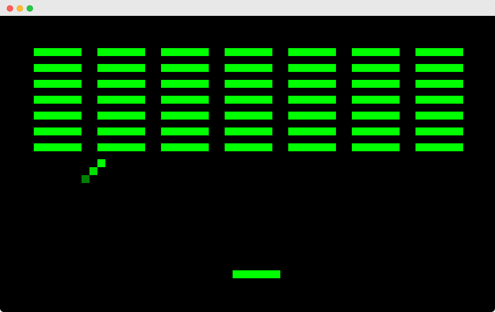

# CHIP-8 Emulator


This is a CHIP-8 emulator written in Rust.

## Usage

```bash
cargo run -- <rom_path>
```

Replace `<rom_path>` with the path to your CHIP-8 ROM file.
You can find ROMs here: [CHIP-8 Archive](https://johnearnest.github.io/chip8Archive/).

## Keybindings
- `1-4`, `Q-R`, `A-F`, `Z-V`: Map to CHIP-8 keys
- `Escape`: Exit the emulator